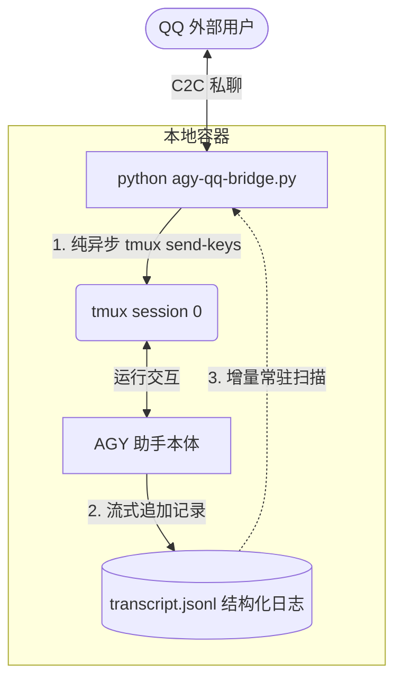

# AGY-QQ-Bridge: 极简 C2C 异步日志增量 QQ 桥接器

AGY-QQ-Bridge 是一个用于将本地常驻运行的 Google Antigravity (AGY) 实例直连到 QQ 个人私聊通道的轻量级桥接系统。

通过采用“去状态机、完全解耦收发、纯异步日志增量监听”的现代化设计，本项目彻底解决了一问一答式同步卡死、时序对不上、以及长耗时任务多次分段回复丢失的痛点。

---

## 🌟 核心架构与优势



*   **输入输出完全解耦**：QQ 消息只管送入终端，后台协程只管监听日志并广播回传。无忙碌锁、无同步超时死锁。
*   **支持“一次输入，多次回复”**：完美契合 AI 助手在执行长耗时任务时分步骤、断断续续地汇报进度的行为特征，保证所有发出的文字 100% 被捕获回传。
*   **自适应重置与热绑定**：在执行 `/new` 切换或重置会话时，监听器会在 0.5 秒内自动绑定新生成的日志文件，并自动定位水位线，杜绝任何历史消息的重复刷屏与多实例逻辑混乱。

---

## 🛠️ 安装与运行

### 1. 

 Python 3  `tmux`

```bash
#  pip 
pip install git+https://github.com/zz327455573/AGY-QQ-Bridge.git

#  --init  bin
which agy-qq-bridge
```

### 2.  

```bash
#  pip  --init 
agy-qq-bridge --init

#  .env  .env 
cp .env.example .env
```

 .env 

*   `APP_ID` / `CLIENT_SECRET`QQ 
*   `MASTER_OPENID` QQ C2C OpenID `--init` 
*   `TMUX_SESSION` AGY  tmux  `0`
*   `AGY_START_CMD` AGY  AGY  tmux 
    *  `cd ~ && agy --dangerously-skip-permissions`
    *  `script -q -c "/root/.local/bin/agy --dangerously-skip-permissions" /dev/null`  agy  PATH script 
*   `BRAIN_DIR`AGY  `brain/`  `~/.gemini/antigravity-cli/brain`

### 3. 使用 PM2 进行守护与热启动

推荐使用 Node.js 的进程管理器 `pm2` 来保证桥接服务的持续运行：
```bash
# 启动桥接服务
pm2 start agy-qq-bridge.py --name agy-qq-bridge

# 查看运行状态与实时日志
pm2 status
pm2 logs agy-qq-bridge
```

---

## 💬 交互指令介绍

在 QQ 个人私聊中，您可以向您的机器人发送以下控制指令：

| 指令 | 作用 | 内部实现逻辑 |
| :--- | :--- | :--- |
| **任意文字** | 交互输入 | 发送 Escape 清理终端 TUI 状态 ➔ 通过 tmux 物理键入 ➔ 回车发送给 AGY |
| **`/new`** | 重置会话 | 强杀旧的 tmux 会话 ➔ 新建 tmux 会话 ➔ 自动拉起全新 AGY 进程 ➔ 桥接器 0.5s 内自动热绑定全新日志 |
| **`/stop`** | 强行终止 | 连续向 tmux 发送三次 `Ctrl+C` 物理信号，强制停止当前的执行任务，恢复命令行状态 |

---

## 📝 更新日志

### v2.1 (2026-07-01)
*   `--init` AGY_START_CMD  AGY  AGY 
*   `.env.example`  `AGY_START_CMD` 
*   README  

### v2.0 (2026-06-29)
*   **多模态支持**：实现了附件功能的零阻拦直传。机器人接收到图片、语音（SILK格式）、视频以及任意文件后，不再进行本地缓存，而是将 QQ 临时下载 URL 自动原样透传给大模型进行原生多模态识别与解析。
*   **代码优化**：升级 API 请求 User-Agent 头至 `AGY-QQ-Bridge/2.0`。